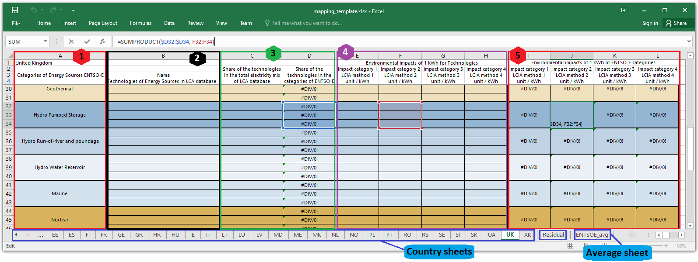
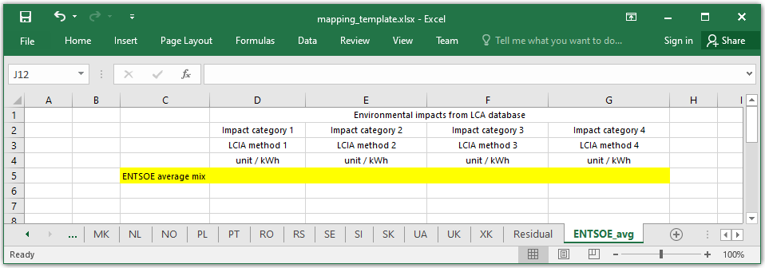
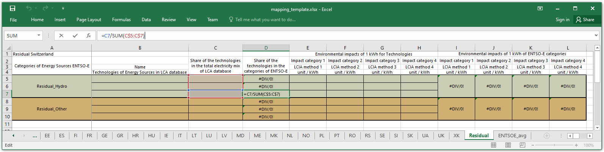

LCA Data
===================

The LCA data can be provided to EcoDynElec using a so-called mapping spreadsheet to be filled by the user (recommended), or a so-called FU vector to be generated by the user. Tutorials are available both about the use of the `spreadsheet <https://ecodynelec.readthedocs.io/en/latest/examples/lca_data.html#mapping-spreadsheet>`__ and the `FU vector <https://ecodynelec.readthedocs.io/en/latest/examples/lca_data.html#fu-vector>`__, while extensive information is available in this page regarding their structure and the meaning.

The mapping spreadsheet contains a methodology to address the discrepancy between the source of electricity generation data and the LCA database from which impact information are extracted. A `blank template <https://github.com/LESBAT-HEIG-VD/EcoDynElec/raw/main/support_files/mapping_template.xlsx>`_ suited for linking the ENTSO-E data with impacts information from an LCA database can be downloaded from the Git. This template already contains equations for all required fields, for all countries represented in the ENTSO-E database.

The data itself is **not provided per default**, for licensing reasons. Thus extracting data from LCA database and softwares is left to the user. However, **for the software to being fully operational**, a default `Functional Unit file <https://github.com/LESBAT-HEIG-VD/EcoDynElec/blob/main/ecodynelec/data/Functional_Unit_Vector.csv>`__ (or FU-vector) is provided. This file contains, for 6 countries only (AT, CH, DE, FR, IT, CZ) and 4 impact categories, the results of LCA data from the Ecoinvent database *after processing it through the mapping spreadsheet*.

The software ``ecodynelec`` can use both a mapping spreadsheet and a FU-vector as input, depending on the ``FU vector`` and ``mapping file`` fields of the ``path`` section of the `configuration <https://ecodynelec.readthedocs.io/en/latest/data_input/parameters.html>`__.

Additional impact indexes can be added or used by the user. The author declines all responsibility of biased results obtained due to incorrect usage of the impact data by the user.

Mapping file structure
------------------------

The mapping template contains 3 types of sheets: country sheets, one residual sheet and one "*average*" sheet.

Country sheet
~~~~~~~~~~~~~

The structure of a country sheet of the mapping file is highlighted in Figure 1. It can be divided into 5 sets of columns: (1) the generation type in ENTSO-E, (2) the corresponding technology(ies) in the LCA database, (3) shares of each technology, (4) the impacts associated to each technology, and (5) the grouped impacts per type of generation type.

    
    *Figure 1: Detailed structure of a country sheet of the (template) mapping file*

The first column of the spreadsheet is for the *generation type* as found in the ENTSO-E database, although it can be modified to better suit other databases, as detailed in a further section. The second column should contain names of specific technologies in an LCA database, or any other useful description. The share of technology allows to weight the importance of each technology when multiple technologies correspond to one same generation type. It is composed of 2 columns, the first to write data as available in the LCA database, the second to balance it out with a pre-filled formula. The impacts relative to each technology must be typed in the fourth block. The fifth block shows the results of aggregated impacts per generation type, weighted by share of technology.

Note that the blocks 4 and 5 of the template were built for four impact indexes, however columns can be added or deleted at will to increase or reduce the number of indicators. More on this in the `dedicated section below <https://ecodynelec.readthedocs.io/en/latest/data_input/lca_data.html#requirements>`_.

Average sheet
~~~~~~~~~~~~~
The average sheet is of utmost importance, as it contains the values that will be used for the impact of electricity originating from countries not included in the computation but neighboring the involved countries. The sheet only requires one impact value per impact category.

    
    *Figure 2: Detailed structure of the average sheet of the (template) mapping file*

Residual sheet
~~~~~~~~~~~~~~
The residual sheet is structured in the exact same way as a country sheet, except for the pre-suggested technologies. In the *Residual* sheet, the two included technologies are the *Residual_Hydro* and the *Residual_Other*, in accordance with the methodology described in the `associated publication <https://www.researchgate.net/profile/Sebastien-Lasvaux/publication/349139291_Dynamic_Life_Cycle_Assessment_of_the_building_electricity_demand/links/60225b5445851589399073e0/Dynamic-Life-Cycle-Assessment-of-the-building-electricity-demand.pdf>`_ and specified in the `dedicated page <https://ecodynelec.readthedocs.io/en/latest/structure/local_residual.html>`_ of the documentation.

    
    *Figure 3: Detailed structure of the residual sheet of the (template) mapping file*

This sheet has been designed so the user can build the residual using existing technologies and its own estimated shares.

Requirements
------------
The mapping template has multiple degrees of freedom, and some key elements that must not be modified in order for the module ``ecodynelec.preprocessing.load_impacts`` to work correctly. This module is responsible for reading the mapping file and selecting required information. Details about the structure of this module are available in the `designated documentation <https://ecodynelec.readthedocs.io/en/latest/structure/load_impacts.html>`_.

Key elements to leave unchanged
~~~~~~~~~~~~~~~~~~~~~~~~~~~~~~~~
On **country sheets**, the module tries to extract information from the last block of columns, named "*Environmental impacts of 1 kWh of ENTSO-E categories*". The algorithm will extract *all columns standing to the right of the last column whose value on the row 1 contains "impact"*. So the user should avoid modifying the first row. Note that when Python reads a spreadsheet, all cells are unmerged and the content of merged cells is attributed to the upper leftmost cell of the aggregate. This also means that the number of impact indexes is **at least one**, but is **not restricted to four**, thus impact columns can be deleted or added at will. Just make sure to extend the formulas.

Still on the **country sheets**, the leftmost column is used for finding the generation types. *All rows of the extracted table that have at least one missing value are ignored*. This gives the flexibility to add **as may new rows as desired** to add new technologies corresponding to a generation category, and this allows to add new generation categories as well if required. Similarly, unused rows can be deleted with no major risks, just make sure to adapt the formulas in the rightmost block of columns. This also means that every generation type that has no corresponding technology from the LCA database will be ignored. Generation categories with at least one technology will be considers, **but make sure that the first row of the generation category is filled**.

The **residual sheet** works exactly the same way as the country sheets.

The **ENTSOE avg sheet** only expects values entered manually. Its format is also more sensitive: in the current version, only the columns 2 to 7 (i.e. C to G) are loaded, and only from the second row. The only row of data that is extracted is where the column C contains "*ENTSOE average mix*". These values are mandatory, as always used in the ``ecodynelec`` process.

Example of possible modifications
~~~~~~~~~~~~~~~~~~~~~~~~~~~~~~~~~~
The last paragraph already mentions most of the possible changes. Beside filling the sheet with adapted values, modifying the headings (impact category names, some specification and the unit) and changing the name of generation categories (not recommended) in the Residual and in the country sheets, it is also possible to modify *all headings but those on the 1st row*, as well as personalizing the calculation methodology (not recommended), adding new generation categories, adding or deleting columns of impact categories, adding or deleting rows of technologies. It is also possible to add spreadsheets if required.

Functional Unit vector
------------------------

The Functional Unit vector (FU vector) is a matrix of values concatenating the rightmost block in the country and residual tabs of a mapping spreadsheet. The FU vector only contains values, i.e. no formula or variables. This vector is the information used by ``ecodynelec`` for the calculation of impacts, resulting from the extraction of information from the mapping spreadsheet **after** filtering of missing information. However the user can also directly provide ``ecodynelec`` with a FU vector in place of a mapping spreadsheet.

The FU vector file has a specific structure. The first row of data always contains the (mandatory) values of the **ENTSOE avg sheet**. Each column is an impact category obtained from the mapping file. For all other rows, the indexes are formatted as follows:
    * *Name_country*: Applicable for all unit types. The names are obtained from the mapping file. Remaining spaces in original names are replaced with an underscore (``_``). The countries are from the parameters. It is important to have the country at the end of the index, separated from the rest with an underscore (``_``).
    * *Mix_Other*: This unique row is used for all electricity imported from outside the bounds of the study (other countries). It is treated as a specific unit type called Mix from a specific country tagged Other. This specific index must be included in the vector.

.. figure:: ./images/FUVector.png
    :alt: FU vector overview

    *Figure 4: Overview of the structure of the default FU vector*

For EcoDynElec to be fully functional even if the user has no access to LCA databases, a **default FU vector was provided** with the software. This default contains the impact values for 6 countries (AT, CH, DE, FR, IT, CZ) and 4 impact categories (Climate Change, Human carcinogenic toxicity, Fine particulate matter formation, Land use), for all producing generation unit types. These values were obtained *processing impact data from the `Ecoinvent <https://ecoinvent.org/>`_ database through the mapping template*.

The author can only guarantee the adequacy of these default values and can not be held responsible for any erroneous result obtained caused by incorrect or unjustified replacement or modification of the impact values in a mapping spreadsheet or FU vector.