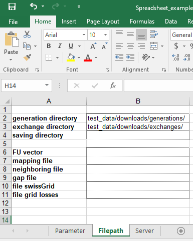

Managing the parameters
=======================

The ``ecodynelec`` software allows high-level customization via some parameters. This document gives an exhaustive description of all the options and how to modify them.

From Python interface
*********************
Parameters can be set directly in Python using the `Parameter` class of ``ecodynelec``. Here is how the ``Parameter`` class is organized and what it contains. For the meaning of each parameter, see the section `Meaning and role of each parameter <https://ecodynelec.readthedocs.io/en/latest/supplementary/parameters.html#meaning-and-role-of-each-parameter>`_.

From the spreadsheet
*********************
Alternatively, parameters can be set via a spreadsheet. An `example spreadsheet <https://gitlab.com/fledee/ecodynelec/-/raw/main/examples/Spreadsheet_example.xlsx?inline=false>`_ can be downloaded for the git repository. Here is what it looks like. For the meaning of each parameter, see the section `Meaning and role of each parameter <https://ecodynelec.readthedocs.io/en/latest/supplementary/parameters.html#meaning-and-role-of-each-parameter>`_.

.. figure:: ./images/ParameterExcel_Param.png
    :alt: Parameter spreadsheet main
    :scale: 80

    *Figure 1: Spreadsheet for setting parameters: main Parameter tab*

    *Figure 2: Spreadsheet for setting parameters: Paths tab*

.. figure:: ./images/ParameterExcel_Server.png
    :alt: Parameter spreadsheet server
    :scale: 80

    *Figure 3: Spreadsheet for setting parameters: Server tab*

Meaning and role of each parameter
**********************************
This section describes the meaning and role of each parameter. The `documentation <https://ecodynelec.readthedocs.io/en/latest/modules/parameter.html>`_ about the `Parameter` class also provides useful descriptions.

Main Parameters
---------------
Main parameters are in the "Parameters" tab of the spreadsheet, or attribures of the object ``Parameter``.

* **countries** (spreadsheet) / ``Parameter.ctry`` (python): List of countries to involve in the computation. Should be a list in Python, and one country per cell on the dedicated row of the spreadsheet. Countries must be reffered to using the `two-letters country code <https://www.nationsonline.org/oneworld/country_code_list.htm>`_. No limit on the number of coutries to include, though the countries must be reporting data to the `ENTSO-E <https://transparency.entsoe.eu>`_.
* **target** (spreadsheet) / ``Parameter.target`` (python): The country in which to evaluate the impacts.
* **start** (spreadsheet) / ``Parameter.start`` (python): Start date. YYYY | MM | dd | HH | mm in the spreadsheet, with one information per cell on the dedicated row. ``"YYYY-MM-dd HH:mm"`` in Python.
* **end** (spreadsheet) / ``Parameter.end`` (python): End date. YYYY | MM | dd | HH | mm in the spreadsheet, with one information per cell on the dedicated row. ``"YYYY-MM-dd HH:mm"`` in Python.
* **frequency** (spreadsheet) / ``Parameter.freq`` (python): Length of the time step. Default is ``H``. Possibilities are ``Y`` (year) ``M`` (month) ``W`` (week) ``d`` (day) ``H`` (hour) ``30min`` and ``15min``.
* **timezone** (spreadsheet) / `Parameter.timezone` (python): Time zone understandable by Python. To convert in local time after the computation.
* **constant exchanges** (spreadsheet) / ``Parameter.cst_imports`` (python): TRUE to consider constant impacts for all countries but the target country. Impacts become equal to the impact of "Other countries". Default is FALSE.
* **exchanges from swissGrid** (spreadsheet) / ``Parameter.sg_imports`` (python): TRUE to replace ENTSO-E cross-border exchanges *at the Swiss borders* with SwissGrid data. Default is FALSE.
* **net exchanges** (spreadsheet) / ``Parameter.net_exchanges`` (python): TRUE to correct cross-border exchanges so that flow between two countries at each time step is only unidirectional. The correction is made *after* adapting data to the desired frequency. Default is FALSE, i.e. data is treated it is.
* **network losses** (spreadsheet) / ``Parameter.network_losses`` (python): TRUE to consider the network losses. Default is FALSE.
* **residual local** (spreadsheet) / ``Parameter.residual_local`` (python): TRUE will include Swiss residual as non-exchangeable production (consumed in CH). Default is FALSE. Cannot be TRUE at the same time as residual global.
* **residual global** (spreadsheet) / ``Parameter.residual_global`` (python): TRUE will include Swiss residual as tradeable production. Default is FALSE. Cannot be TRUE at the same time as residual local.
* **data cleaning** (spreadsheet) / ``Parameter.data_cleaning`` (python): TRUE to turn on the data autocompleting process. Missing data is replaced with zeros otherwise. Default is TRUE.

Filepath Parameters
-------------------
File path parameters are in the "Filepath" tab of the spreadsheet, or attribures of the object ``Parameter.path``.

* **generation directory** (spreadsheet) / ``Parameter.path.generation`` (python): Directory containing the generation data. This is also the directory where downloaded files are saved. Path can be relative to the location where the user's script is executed, or the absolute path.
* **exchange directory** (spreadsheet) / ``Parameter.path.exchanges`` (python): Directory containing the exchanges data. This is also the directory where downloaded files are saved. Path can be relative to the location where the user's script is executed, or the absolute path.
* **saving directory** (spreadsheet) / ``Parameter.path.savedir`` (python): Directory where to save computation results. Results are only returned in Python if the field is empty or None. Path can be relative to the location where the user's script is executed, or the absolute path. Default is None.
* **FU vector** (spreadsheet) / ``Parameter.path.fu_vector`` (python): The location of impact per unit type in a single table format. Default file from the support files is used if None is given.
* **mapping file** (spreadsheet) / ``Parameter.path.mapping`` (python): The location of a mapping file. A blank example is available for download on the `git repository <https://gitlab.com/fledee/ecodynelec/-/raw/main/support_files/mapping_template.xlsx?inline=false>`_. Default FU vector from the support files is used if None is given.
* **neighboring file** (spreadsheet) / ``Parameter.path.neighbours`` (python): The location of a file reporting the connectivity between european countries. Default file from the support files is used if None is given.
* **gap file** (spreadsheet) / ``Parameter.path.gap`` (python): The location of a file containing estimates of the composition of the Swiss residual. Default file from the support files is used if None is given.
* **file swissGrid** (spreadsheet) / ``Parameter.path.swissGrid`` (python): The location of a file containing information from SwissGrid. Default file from the support files is used if None is given.
* **file grid losses** (spreadsheet) / ``Parameter.path.networkLosses`` (python): The location of a file containing estimates of power grid losses. Default file from the support files is used if None is given.

Server Parameters
-------------------
Server parameters are in the "Server" tab of the spreadsheet, or attribures of the object ``Parameter.server``. They allow to configure the connexion to the ENTSO-E server to retrieve data, as detailed in the dedicated `supplementary information <https://ecodynelec.readthedocs.io/en/latest/supplementary/download.html>`_ and `example <https://ecodynelec.readthedocs.io/en/latest/examples/Downloading.html>`_ pages.

* **host** (spreadsheet) / ``Parameter.server.host`` (python): Name of the sftp host. Default is ``sftp-transparencyentsoe.eu``.
* **port** (spreadsheet) / ``Parameter.server.port`` (python): ID number of the port to use. Default is 22.
* **username** (spreadsheet) / ``Parameter.server.username`` (python): Username or email to connect to the ENTSO-E database. Account should be created for free on the `ENTSO-E webpage <https://transparency.entsoe.eu/>`_. The password gets outdated regularly (one to two months or after a period without using).
* **password** (spreadsheet) / ``Parameter.server.password`` (python): Password to connect to the entsoe database (optional). For security reasons, the field can be left blank (spreadsheet) or set to None (python), and the password will be asked when just ``ecodynelec`` establishes a connection with the servers.
* **use server** (spreadsheet) / ``Parameter.server.useServer`` (python): TRUE to request downloading files from the ENTSO-E database. FALSE (default) will not download.
* **remove unused** (spreadsheet) / ``Parameter.server.removeUnused`` (python): TRUE to remove all local files whose dates do not correspond to the required computation period. FALSE (default) will not delete any file. This functionality is ignored if no file is downloaded.
