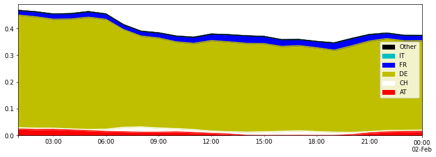

Examples of graphs to show results
==================================

This notebook shows examples of how DYNAMICAL results can be visualized.
DYNAMICAL only handles electricity tracking and LCA impacts computation.
Graph functionalities are not implemented in DYNAMICAL.

.. code:: ipython3

    from dynamical.pipelines import execute # Import the execution function
    
    import pandas
    from numpy import unique
    import matplotlib.pyplot as plt # Not included in package requirements

.. code:: ipython3

    impacts = execute(config='Spreadsheet_test.xlsx') # Compute electricity tracking and impacts

Group per country
-----------------

.. code:: ipython3

    def compute_per_country(results):
        """Function to group results per country"""
        countries = unique([c.split("_")[-1] for c in results.columns]) # List of countries
        
        per_country = []
        for c in countries:
            cols = [k for k in results.columns if k[-3:]==f"_{c}"]
            per_country.append(pandas.Series(results.loc[:,cols].sum(axis=1), name=c))
            
        return pandas.concat(per_country,axis=1)

.. code:: ipython3

    gwp_per_country = compute_per_country(impacts['GWP']) # Group GWP impacts per country

.. parsed-literal::

    ['AT' 'CH' 'DE' 'FR' 'IT' 'Other']

.. code:: ipython3

    gwp_per_country.plot.area(figsize=(12,4), legend='reverse', color=['r','w','y','b','c','k'])

.. parsed-literal::

    <AxesSubplot:>

Group per production type
-------------------------

.. code:: ipython3

    def compute_per_type(results):
        """Function to group datasets per type of unit, regardless of the country of origin"""
        unit_list = unique([k[:-3] for k in results.columns]) # List the different production units
        
        per_unit = []
        for u in unit_list:
            cols = [k for k in results.columns if k[:-3]==u] # collect the useful columns
            per_unit.append(pandas.Series(results.loc[:,cols].sum(axis=1), name=u)) # aggregate
    
        return pandas.concat(per_unit,axis=1)

.. code:: ipython3

    es13_per_type = compute_per_type(impacts['ES2013']) # Group GWP impacts per country

.. code:: ipython3

    es13_per_type.plot.area(figsize=(12,8), legend='reverse')

.. parsed-literal::

    <AxesSubplot:>

.. image:: Exploit_results_files/Exploit_results_10_1.png

