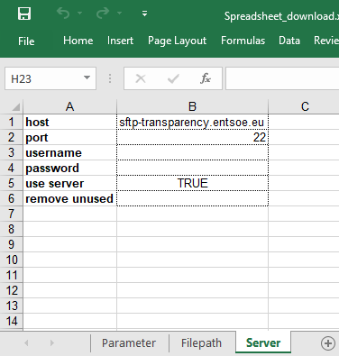
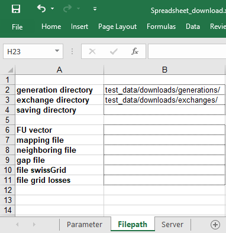

Downloading ENTSO-E data
========================

Data from the ENTSO-E is at the heat of EcoDynElec. Though
EcoDynElec integrates the possibility to download the required data
from ENTSO-E servers directly, and can also deal with already manually
downloaded data. This tutorial details the different possibilities to
download the ENTSO-E data, i.e. with and without EcoDynElec.

In any case, \ **an account must be created**\  on the `ENTSO-E
website <https://transparency.entsoe.eu/>`__ for using the SFTP service
and access the data.

Manual downloading
------------------

Manual retrieval of the data requires an FTP software. We use
`FileZilla <https://filezilla-project.org/>`__ to illustrate the
procedure. Provide the software with:
* Host: ``sftp://sftp-transparency.entsoe.eu``
* Port: 22
* Personal credentials

Navigate through the remote architecture and download the files of
interest. The generation files are located in
``/TP_export/AggregatedGenerationPerType_16.1.B_C/``. The exchanges
files are located in ``/TP_export/PhysicalFlows_12.1.G/``. *Figure 1*
give details on how to proceed with FileZilla.

.. figure:: ./images/Filezilla.png.png
    :alt: FileZilla interface

    *Figure 1: Download files using FileZilla*

Downloading via EcoDynElec
------------------------------

The data can be downloaded via EcoDynElec.

First, the configuration must be adapted, either using a
`spreadsheet <https://ecodynelec.readthedocs.io/en/latest/examples/downloading.html#configuration-via-spreadsheet>`__
or using
`python <https://ecodynelec.readthedocs.io/en/latest/examples/downloading.html#configuration-in-python>`__.

Then the download can be triggered, either in a `standalone
fashion <https://ecodynelec.readthedocs.io/en/latest/examples/downloading.html#standalone-download>`__
or as part of the whole computation pipeline. The global tutorials on
how to use ``ecodynelec`` `fully in
Python <https://ecodynelec.readthedocs.io/en/latest/examples/with_python.html#execution>`__
and `with spreadsheet
configuration <https://ecodynelec.readthedocs.io/en/latest/examples/with_spreadsheet.html#execution>`__
give more details on the latter.

Configuration via spreadsheet
~~~~~~~~~~~~~~~~~~~~~~~~~~~~~

The spreadsheet used in this tutorial can be downloaded from the `examples on the GitHub <https://github.com/LESBAT-HEIG-VD/EcoDynElec/raw/main/examples/Spreadsheet_download.xlsx>`__.

    *Figure 2: Spreadsheet for configuration: Server tab suited for download*

Each field must be written as presented, in low case. The fields are: 
* **host**: the address of the sftp server. Per default, we use “*sftp-transparency.entsoe.eu*”.
* **port**: the port to connect to the server. Per default, the port is *22*.
* **username**: your username, as created for free on the `ENTSO-E website <https://transparency.entsoe.eu/>`__. It should be an
email@address. If the field is left blank in the spreadsheet, the
credential will be asked when the downloading is launched.
* **password**: your password, as created for free on the `ENTSO-E
website <https://transparency.entsoe.eu/>`__. For security reasons, we
do recommend to let the field blank, which will let the ``downloading``
package ask for the password in a more secured manner.
* **use server**: **TRUE** if you want to download the data. Blank or **FALSE**
will not download the data (default).
* **remove unused**: **TRUE** if you want the target directories (where to download) to be emptied before downloading. Blank or **FALSE** to ignore other files in the target directory (default).

The files will be downloaded and saved in the directories indicated at
the fields **path generation** and **path exchanges** of the tab
*Filepath* of the spreadsheet (c.f. *Figure 3*). Also make sure you set
the date accordingly (tab *Parameter*), to allow the selection of files
to download. More information on the various configuration possibilities
available in the `input data
section <https://ecodynelec.readthedocs.io/en/latest/data_input/parameters.html>`__.

    *Figure 3: Spreadsheet for configuration: Paths tab*
    

Configuration in Python
~~~~~~~~~~~~~~~~~~~~~~~

.. code:: ipython3

    from ecodynelec.parameter import Parameter # Import the configuration management class
    
    # Initialize the parameter class
    my_config = Parameter()

The server connection needs a configuration which is not the default.
Here is how to change it.

**Note** that credentials can be specified directly in the configuration
object, but this is not necessary. Instead in this example, we let them
empty (or ``None`` for the example, which is strictly equivalent), and
these will be asked later when the downloading starts.

.. code:: ipython3

    ### Configure the server connection
    my_config.server.useServer = True # Specifically ask to download data
    my_config.server.host = "sftp-transparency.entsoe.eu" # This server is already set per default after initialization
    my_config.server.port = 22 # This port is already set per default after initialization
    
    ### Credentials
    my_config.server.username = None
    my_config.server.password = None

Each field is accessible and modifiable with the syntax
``my_config.server.field``. The fields are:
* ``host``: the address of the sftp server. Per default, we use “*sftp-transparency.entsoe.eu*”.
* ``port``: the port to connect to the server. Per default, the port is *22*.
* ``username``: your username, as created for free on the
`ENTSO-E website <https://transparency.entsoe.eu/>`__. It should be an
email@address. If the field is left blank in the spreadsheet, the
credential will be asked when the downloading is launched.
* ``password``: your password, as created for free on the `ENTSO-E
website <https://transparency.entsoe.eu/>`__. For security reasons, we
do recommend to not specify it, which will let the ``downloading``
package ask for the password in a more secured manner.
* ``useServer``:
**TRUE** if you want to download the data. Blank or **FALSE** will not
download the data (default).
* ``removeUnused``: **TRUE** if you want
the target directories (where to download) to be emptied before
downloading. Blank or **FALSE** to ignore other files in the target
directory (default).
* ``_remoteGenerationDir``: where to find the
generation data on the ENTSO-E server. This field should be left per
default, i.e. not specified. However it is included for flexibility
purpose if the server modifies its architecture.
* ``_remoteExchangesDir``: where to find the exchanges data on the ENTSO-E
server. This field should be left per default, i.e. not specified.
However it is included for flexibility purpose if the server modifies
its architecture.

The data will be downloaded where the ``my_config.path`` section points
at, these fields must then be specified. Note that these ``path``
settings are the same used by ``ecodynelec`` to find local files
containing data to be used in the main computation.

.. code:: ipython3

    # Indicate where to save generation data
    my_config.path.generation = "./test_data/downloads/generations/"
    
    # Indicate where to save exchange data
    my_config.path.exchanges = "./test_data/downloads/exchanges/"

Finally, the ``start`` and ``end`` dates must be specified in the main
section of the configuration object to only download the useful files.

.. code:: ipython3

    ### Set the dates (to select files to download)
    my_config.start = '2017-02-01 05:00'
    my_config.end = '2017-02-01 13:00'

Standalone download
~~~~~~~~~~~~~~~~~~~

Once the configuration is set properly, the download can be triggered.
This section demonstrates the standalone download, and showcases the
additional specific parameters otherwise not accessible. However for a
more generic usage, the downloading feature has also been integrated to
the `whole computation
pipeline <https://ecodynelec.readthedocs.io/en/latest/examples/downloading.html#downloading-via-ecodynelec>`__
of EcoDynElec.

.. code:: ipython3

    from ecodynelec.preprocessing.downloading import download

Here all parameters are specified, however only ``config`` is mandatory,
and every other parameter use default values if not specified.

**Note** that the configuration used here relies on the
``Spreadsheet_download.xlsx``, but similarly to the whole EcoDynElec
pipeline, the ``config=`` parameter can also be a ``Parameter`` object,
such as the ``my_config`` that was built in the `above
section <https://ecodynelec.readthedocs.io/en/latest/examples/downloading.html#configuration-in-python>`__.

.. code:: ipython3

    download(config="./Spreadsheet_download.xlsx", threshold_minutes=15, threshold_size=0.9, is_verbose=True)

.. parsed-literal::

    Connection...

.. parsed-literal::

    Username:  user@mail.com
    Password:  ········

.. parsed-literal::

    [Generation 1/1] Transferred: 45.9 MB	Out of: 118.1          

.. parsed-literal::

    
    KeyboardInterrupt
    

The download can be a time consuming process, Thus in the previous cell,
the few extra parameters help deciding whether or not downloading a
specific file from the server. This comes handy only in the case of
re-using EcoDynElec regularly, an occasional or one-time usage will
not be affected by these extra parameters.

-  ``threshold_minutes``: if the last modification of a file on the
   server occurred *less than* ``threshold_minutes`` *after* the last
   download of that file (if the downloaded file still exist on the
   user’s computer too), the remote file is not downloaded. **Default is
   15 min**. The server "modifies" files regularly, either with no
   changes in the data (simple server maintenance) or some data
   modifications (as new information comes in). The parameter allows to
   skip a file if the file on the server is considered as not new
   enough.

-  ``threshold_size``: If the file has been partially downloaded, but
   the size of the local file is *less than* ``threshold_size`` of the
   server file (i.e. downloaded one is *significantly* smaller than the
   file on server), then the file is downloaded again. **Default is
   90%**, i.e. the local copy must be less than 90% of the size of the
   remote to force the download. For whatever reason, a download may
   fail half way (connection issue, manually stopping a too-long
   process, etc.). In such case, ``threshold_minutes`` may prevent to
   resume the download. For this reason, ``threshold_size`` was added to
   still force a download even if a file does not comply with the
   ``threshold_minutes`` rule.
