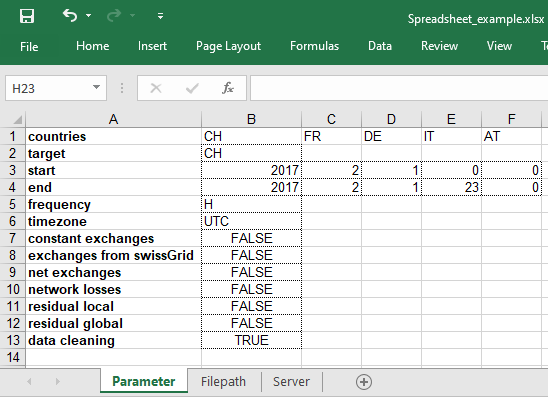
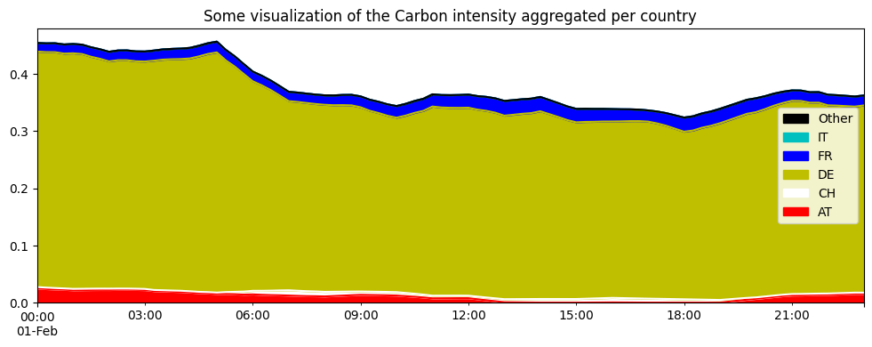
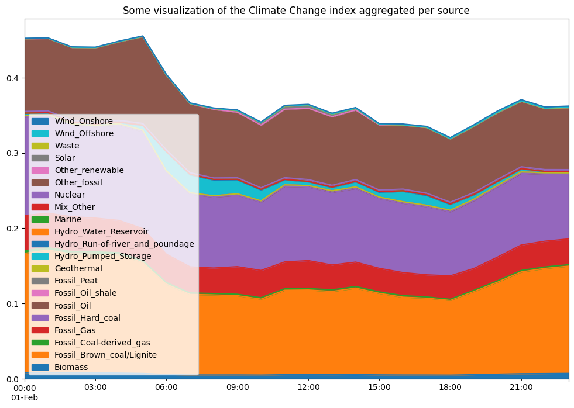

Using with a spreadsheet-based configuration
============================================

EcoDynElec offers the possibility to configure the execution via a
spreadsheet, for more user-friendly handling. This tutorial shows the
different steps and possibilities in this regard. As EcoDynElec is
firstly designed for research purposes, there also is the possibility to
entirely rely on a python-based configuration , as developed in the
“`Using fully with
Python <https://ecodynelec.readthedocs.io/en/latest/examples/with_python.html>`__”
tutorial.

Initialization
--------------

To download and install EcoDynElec to being used as a python
package, the user is referred to either the `getting started
tutorial <https://ecodynelec.readthedocs.io/en/latest/examples/getting_started.html>`__.

Configuration
-------------

The configuration of EcoDynElec is to be handled in a spreadsheet.
Figure 1-3 show the three sections of the spreadsheet used in this
example. The spreadsheet can be downloaded from the `github
repository <https://github.com/LESBAT-HEIG-VD/EcoDynElec/raw/main/examples/Spreadsheet_example.xlsx>`__.

The configuration is composed of 3 parts. The detail about the meaning
of each is developed in the `input data
section <https://ecodynelec.readthedocs.io/en/latest/data_input/parameters.html>`__.

    *Figure 1: Spreadsheet for configuration: main Parameter tab*

the first tab (*Figure 1*) contains the elements to configure the
execution itself.

    *Figure 2: Spreadsheet for configuration: Paths tab*

the second tab (*Figure 2*) deals with all paths to information files,
directory containing information, or where to write and save information
before, during and after the computation. **Note** that, for the
``generation``, ``exchanges`` and ``savedir`` directories fields, the
specified directory *will be created if it does not already exist*. For
every other file path element, *a default file* is used if the field is
left blank, and an error is returned if the information passed does not
correspond to any existing file on your local machine.

.. figure:: ./images/ParameterExcel_PathsExample.png
    :alt: Spreadsheet server
    :scale: 80

    *Figure 3: Spreadsheet for configuration: Server tab*

the third tab (*Figure 3*) deals with information related to the ENTSO-E
server, as electricity data from the ENTSO-E server is at the center of
EcoDynElec. More on this topic is covered on the next paragraph and
on the dedicated `downloading
tutorial <https://ecodynelec.readthedocs.io/en/latest/examples/downloading.html>`__.
**Note** that per default, the field ``use server`` is set to FALSE,
i.e. no download will occur. Also note that the ``username`` field is
supposed to be an email address.

Downloading Entso-E data
~~~~~~~~~~~~~~~~~~~~~~~~

The `downloading
tutorial <https://ecodynelec.readthedocs.io/en/latest/examples/downloading.html>`__
covers the specificities about how to download the ENTSO-E data or
include the download as part of the EcoDynElec pipeline execution.
This feature is not triggered per default and EcoDynElec is
expecting to find already downloaded ENTSO-E files.

Execution
---------

EcoDynElec is build out of a myriad of modules that can be used
relatively independently, under the condition that inputs data is shaped
the correct way. Fortunately, the entire pipeline starting from a set of
parameters and computing down to the calculation of impact metrics.

The usage of this entire pipeline is demonstrated below. This pipeline
allows to save results into files (c.f. paragraph on
`configuration <https://ecodynelec.readthedocs.io/en/latest/examples/with_spreadsheet.html#configuration>`__).
However results are also always returned for further in-script use.
These results are stored in the ``impacts`` variable for later
paragraphs in this tutorial.

.. code:: ipython3

    from ecodynelec.pipelines import execute

.. code:: ipython3

    impacts = execute(config="./Spreadsheet_example.xlsx", is_verbose=True)

.. parsed-literal::

    Load auxiliary datasets...
    Load generation data...
    	Generation data.
    Data loading: 0.03 sec..
    Memory usage table: 0.18 MB
    Autocomplete...               5/5)...
    	Completed.                              
    Extraction raw generation: 0.15 sec.             
    	Extraction time: 0.18 sec.
    	4/4 - Resample exchanges to H steps...
    Get and reduce importation data...
    	Cross-border flow data.
    Data loading: 0.02 sec..
    Memory usage table: 0.04 MB
    Autocomplete...               ...
    	Completed.                              
    Extraction raw import: 0.10 sec.             
    	Extraction time: 0.12 sec.
    Resample exchanges to H steps...
    Gather generation and importation...
    Import of data: 0.3 sec
    Importing information...
    Tracking origin of electricity...
    	compute for day 1/1   
    	Electricity tracking: 0.4 sec.
    
    Compute the electricity impacts...
    	Global...
    	Climate Change...
    	Human carcinogenic toxicity...
    	Fine particulate matter formation...
    	Land use...
    Impact computation: 0.0 sec.
    Adapt timezone: UTC >> UTC
    done.

Outcome and Visualization
-------------------------

The outcome is stored in files and returned for further in-script use.
In the previous section, results were stored in the ``impacts``
variable. The current section highlights the content returned and shows
some basic possibilities for data visualization.

.. code:: ipython3

    import numpy as np
    import pandas as pd

Description of the outcome
~~~~~~~~~~~~~~~~~~~~~~~~~~

The ``impacts`` variable contains a collection of tables. This
collection is a ``dict`` with one ``Global`` key, and one other key per
impact category:

.. code:: ipython3

    print(impacts.keys())

.. parsed-literal::

    dict_keys(['Global', 'Climate Change', 'Human carcinogenic toxicity', 'Fine particulate matter formation', 'Land use'])

The ``Global`` table is the *sum across all technologies* for each
index, as it is shown for the first few time steps:

.. code:: ipython3

    display(impacts['Global'].head())

.. raw:: html

    

    
    <table border="1" class="dataframe">
      <thead>
        <tr style="text-align: right;">
          <th></th>
          <th>Climate Change</th>
          <th>Human carcinogenic toxicity</th>
          <th>Fine particulate matter formation</th>
          <th>Land use</th>
        </tr>
      </thead>
      <tbody>
        <tr>
          <th>2017-02-01 00:00:00</th>
          <td>0.459054</td>
          <td>0.030574</td>
          <td>0.000351</td>
          <td>0.007278</td>
        </tr>
        <tr>
          <th>2017-02-01 01:00:00</th>
          <td>0.459154</td>
          <td>0.030907</td>
          <td>0.000351</td>
          <td>0.007191</td>
        </tr>
        <tr>
          <th>2017-02-01 02:00:00</th>
          <td>0.447345</td>
          <td>0.030145</td>
          <td>0.000344</td>
          <td>0.007016</td>
        </tr>
        <tr>
          <th>2017-02-01 03:00:00</th>
          <td>0.447053</td>
          <td>0.030208</td>
          <td>0.000347</td>
          <td>0.006967</td>
        </tr>
        <tr>
          <th>2017-02-01 04:00:00</th>
          <td>0.454442</td>
          <td>0.030573</td>
          <td>0.000358</td>
          <td>0.006873</td>
        </tr>
      </tbody>
    </table>
    

The other tables are, for each impact category, the breakdown into all
possible sources:

.. code:: ipython3

    for i in impacts: # Iterate for all impact categories
        if i=='Global': continue; # Skip the Global, already visualized above.
        
        print(f"#############\nimpacts for {i}:")
        display( impacts[i].head(3).T ) # Transpose table for readability

.. parsed-literal::

    #############
    impacts for Climate Change:

.. raw:: html

    

    
    <table border="1" class="dataframe">
      <thead>
        <tr style="text-align: right;">
          <th></th>
          <th>2017-02-01 00:00:00</th>
          <th>2017-02-01 01:00:00</th>
          <th>2017-02-01 02:00:00</th>
        </tr>
        <tr>
          <th>Climate Change_source</th>
          <th></th>
          <th></th>
          <th></th>
        </tr>
      </thead>
      <tbody>
        <tr>
          <th>Mix_Other</th>
          <td>0.006730</td>
          <td>0.006343</td>
          <td>0.006455</td>
        </tr>
        <tr>
          <th>Biomass_AT</th>
          <td>0.000331</td>
          <td>0.000301</td>
          <td>0.000302</td>
        </tr>
        <tr>
          <th>Fossil_Brown_coal/Lignite_AT</th>
          <td>0.000000</td>
          <td>0.000000</td>
          <td>0.000000</td>
        </tr>
        <tr>
          <th>Fossil_Coal-derived_gas_AT</th>
          <td>0.000000</td>
          <td>0.000000</td>
          <td>0.000000</td>
        </tr>
        <tr>
          <th>Fossil_Gas_AT</th>
          <td>0.017903</td>
          <td>0.016169</td>
          <td>0.016806</td>
        </tr>
        <tr>
          <th>...</th>
          <td>...</td>
          <td>...</td>
          <td>...</td>
        </tr>
        <tr>
          <th>Other_renewable_IT</th>
          <td>0.000000</td>
          <td>0.000000</td>
          <td>0.000000</td>
        </tr>
        <tr>
          <th>Solar_IT</th>
          <td>0.000000</td>
          <td>0.000000</td>
          <td>0.000000</td>
        </tr>
        <tr>
          <th>Waste_IT</th>
          <td>0.000000</td>
          <td>0.000000</td>
          <td>0.000000</td>
        </tr>
        <tr>
          <th>Wind_Offshore_IT</th>
          <td>0.000000</td>
          <td>0.000000</td>
          <td>0.000000</td>
        </tr>
        <tr>
          <th>Wind_Onshore_IT</th>
          <td>0.000000</td>
          <td>0.000000</td>
          <td>0.000000</td>
        </tr>
      </tbody>
    </table>
    
101 rows × 3 columns

    

.. parsed-literal::

    #############
    impacts for Human carcinogenic toxicity:

.. raw:: html

    

    
    <table border="1" class="dataframe">
      <thead>
        <tr style="text-align: right;">
          <th></th>
          <th>2017-02-01 00:00:00</th>
          <th>2017-02-01 01:00:00</th>
          <th>2017-02-01 02:00:00</th>
        </tr>
        <tr>
          <th>Human carcinogenic toxicity_source</th>
          <th></th>
          <th></th>
          <th></th>
        </tr>
      </thead>
      <tbody>
        <tr>
          <th>Mix_Other</th>
          <td>0.000449</td>
          <td>0.000423</td>
          <td>0.000430</td>
        </tr>
        <tr>
          <th>Biomass_AT</th>
          <td>0.000023</td>
          <td>0.000021</td>
          <td>0.000021</td>
        </tr>
        <tr>
          <th>Fossil_Brown_coal/Lignite_AT</th>
          <td>0.000000</td>
          <td>0.000000</td>
          <td>0.000000</td>
        </tr>
        <tr>
          <th>Fossil_Coal-derived_gas_AT</th>
          <td>0.000000</td>
          <td>0.000000</td>
          <td>0.000000</td>
        </tr>
        <tr>
          <th>Fossil_Gas_AT</th>
          <td>0.000129</td>
          <td>0.000116</td>
          <td>0.000121</td>
        </tr>
        <tr>
          <th>...</th>
          <td>...</td>
          <td>...</td>
          <td>...</td>
        </tr>
        <tr>
          <th>Other_renewable_IT</th>
          <td>0.000000</td>
          <td>0.000000</td>
          <td>0.000000</td>
        </tr>
        <tr>
          <th>Solar_IT</th>
          <td>0.000000</td>
          <td>0.000000</td>
          <td>0.000000</td>
        </tr>
        <tr>
          <th>Waste_IT</th>
          <td>0.000000</td>
          <td>0.000000</td>
          <td>0.000000</td>
        </tr>
        <tr>
          <th>Wind_Offshore_IT</th>
          <td>0.000000</td>
          <td>0.000000</td>
          <td>0.000000</td>
        </tr>
        <tr>
          <th>Wind_Onshore_IT</th>
          <td>0.000000</td>
          <td>0.000000</td>
          <td>0.000000</td>
        </tr>
      </tbody>
    </table>
    
101 rows × 3 columns

    

.. parsed-literal::

    #############
    impacts for Fine particulate matter formation:

.. raw:: html

    

    
    <table border="1" class="dataframe">
      <thead>
        <tr style="text-align: right;">
          <th></th>
          <th>2017-02-01 00:00:00</th>
          <th>2017-02-01 01:00:00</th>
          <th>2017-02-01 02:00:00</th>
        </tr>
        <tr>
          <th>Fine particulate matter formation_source</th>
          <th></th>
          <th></th>
          <th></th>
        </tr>
      </thead>
      <tbody>
        <tr>
          <th>Mix_Other</th>
          <td>0.000010</td>
          <td>0.000009</td>
          <td>0.000009</td>
        </tr>
        <tr>
          <th>Biomass_AT</th>
          <td>0.000001</td>
          <td>0.000001</td>
          <td>0.000001</td>
        </tr>
        <tr>
          <th>Fossil_Brown_coal/Lignite_AT</th>
          <td>0.000000</td>
          <td>0.000000</td>
          <td>0.000000</td>
        </tr>
        <tr>
          <th>Fossil_Coal-derived_gas_AT</th>
          <td>0.000000</td>
          <td>0.000000</td>
          <td>0.000000</td>
        </tr>
        <tr>
          <th>Fossil_Gas_AT</th>
          <td>0.000006</td>
          <td>0.000005</td>
          <td>0.000005</td>
        </tr>
        <tr>
          <th>...</th>
          <td>...</td>
          <td>...</td>
          <td>...</td>
        </tr>
        <tr>
          <th>Other_renewable_IT</th>
          <td>0.000000</td>
          <td>0.000000</td>
          <td>0.000000</td>
        </tr>
        <tr>
          <th>Solar_IT</th>
          <td>0.000000</td>
          <td>0.000000</td>
          <td>0.000000</td>
        </tr>
        <tr>
          <th>Waste_IT</th>
          <td>0.000000</td>
          <td>0.000000</td>
          <td>0.000000</td>
        </tr>
        <tr>
          <th>Wind_Offshore_IT</th>
          <td>0.000000</td>
          <td>0.000000</td>
          <td>0.000000</td>
        </tr>
        <tr>
          <th>Wind_Onshore_IT</th>
          <td>0.000000</td>
          <td>0.000000</td>
          <td>0.000000</td>
        </tr>
      </tbody>
    </table>
    
101 rows × 3 columns

    

.. parsed-literal::

    #############
    impacts for Land use:

.. raw:: html

    

    
    <table border="1" class="dataframe">
      <thead>
        <tr style="text-align: right;">
          <th></th>
          <th>2017-02-01 00:00:00</th>
          <th>2017-02-01 01:00:00</th>
          <th>2017-02-01 02:00:00</th>
        </tr>
        <tr>
          <th>Land use_source</th>
          <th></th>
          <th></th>
          <th></th>
        </tr>
      </thead>
      <tbody>
        <tr>
          <th>Mix_Other</th>
          <td>0.000194</td>
          <td>0.000182</td>
          <td>0.000186</td>
        </tr>
        <tr>
          <th>Biomass_AT</th>
          <td>0.001016</td>
          <td>0.000926</td>
          <td>0.000926</td>
        </tr>
        <tr>
          <th>Fossil_Brown_coal/Lignite_AT</th>
          <td>0.000000</td>
          <td>0.000000</td>
          <td>0.000000</td>
        </tr>
        <tr>
          <th>Fossil_Coal-derived_gas_AT</th>
          <td>0.000000</td>
          <td>0.000000</td>
          <td>0.000000</td>
        </tr>
        <tr>
          <th>Fossil_Gas_AT</th>
          <td>0.000066</td>
          <td>0.000060</td>
          <td>0.000062</td>
        </tr>
        <tr>
          <th>...</th>
          <td>...</td>
          <td>...</td>
          <td>...</td>
        </tr>
        <tr>
          <th>Other_renewable_IT</th>
          <td>0.000000</td>
          <td>0.000000</td>
          <td>0.000000</td>
        </tr>
        <tr>
          <th>Solar_IT</th>
          <td>0.000000</td>
          <td>0.000000</td>
          <td>0.000000</td>
        </tr>
        <tr>
          <th>Waste_IT</th>
          <td>0.000000</td>
          <td>0.000000</td>
          <td>0.000000</td>
        </tr>
        <tr>
          <th>Wind_Offshore_IT</th>
          <td>0.000000</td>
          <td>0.000000</td>
          <td>0.000000</td>
        </tr>
        <tr>
          <th>Wind_Onshore_IT</th>
          <td>0.000000</td>
          <td>0.000000</td>
          <td>0.000000</td>
        </tr>
      </tbody>
    </table>
    
101 rows × 3 columns

    

Group per country
~~~~~~~~~~~~~~~~~

The following piece of code suggests a basic visualization of the
Climate Change category, grouping the results per country of origin of
the tracked electricity.

.. code:: ipython3

    def compute_per_country(results):
        """Function to group results per country"""
        countries = np.unique([c.split("_")[-1] for c in results.columns]) # List of countries
        
        per_country = []
        for c in countries:
            cols = [k for k in results.columns if k[-3:]==f"_{c}"]
            per_country.append(pd.Series(results.loc[:,cols].sum(axis=1), name=c))
            
        return pd.concat(per_country,axis=1)

.. code:: ipython3

    gwp_per_country = compute_per_country(impacts['Climate Change']) # Group Climate Change index impacts per country
    gwp_per_country.plot.area(figsize=(12,4), legend='reverse', color=['r','w','y','b','c','k'],
                              title="Some visualization of the Climate Change index aggregated per country"); # Build the graph

Group per production type
~~~~~~~~~~~~~~~~~~~~~~~~~

The following piece of code suggests a basic visualization of the
Climate Change category, grouping the results per technology of origin
of the tracked electricity.

.. code:: ipython3

    def compute_per_type(results):
        """Function to group datasets per type of unit, regardless of the country of origin"""
        unit_list = np.unique([k[:-3] if k[-3]=="_" else k for k in results.columns]) # List the different production units
        
        per_unit = []
        for u in unit_list:
            cols = [k for k in results.columns if k[:-3]==u] # collect the useful columns
            per_unit.append(pd.Series(results.loc[:,cols].sum(axis=1), name=u)) # aggregate
    
        return pd.concat(per_unit,axis=1)

.. code:: ipython3

    es13_per_type = compute_per_type(impacts['Climate Change']) # Group Climate Change index impacts per country
    es13_per_type.plot.area(figsize=(12,8), legend='reverse',
                            title="Some visualization of the Climate Change index aggregated per source"); # Build the graph

