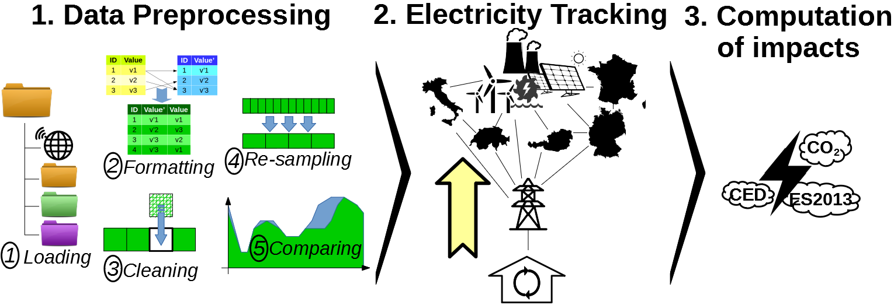

EcoDynElec: Dynamic Life Cycle Assessment of electricity for ENTSO-E countries
==============================================================================

EcoDynElec software tracks the origin of electricity accross european countries based on generation and cross-border exchanges and allows the dynamic evaluation of environmental impacts of electricity.

``ecodynelec`` is a free software under MIT licence. It was developped in a collaboration between the `EMPA <https://www.empa.ch/>`_, `HEIG-VD <https://heig-vd.ch/>`_, the `SUPSI <https://www.supsi.ch/home.html>`_.

Getting started
===============

``ecodynelec`` must first be cloned from its `Git repository <https://github.com/LESBAT-HEIG-VD/EcoDynElec>`__, by using prompt (example below) or any other method::

    >> cd path/to/where/to/download/elecodyn
    
    >> git clone https://github.com/LESBAT-HEIG-VD/EcoDynElec.git

After cloning the repository, the package can be used and installed in different ways, as explained below.

Conventional install
--------------------

Typical python installation softwares such as ``pip`` or ``conda`` can be used to install
``ecodynelec`` from your local copy of the git. To do so, use a prompt or a terminal and 
move inside the ``ecodynelec/`` directory. From there, use ``pip`` (example) or ``conda``
to install.::

    >> cd /path-to-ecodynelec-copy/ecodynelec/

    >> pip install elecodyn

An alternative is to use python to trigger the ``setup.py`` file within the ``ecodynelec/``
directory. More on this in the `official Python documentation 
<https://docs.python.org/3/install/#distutils-based-source-distributions>`__::

    >> cd /path-to-ecodynelec-copy/ecodynelec/

    >> python setup.py install

Now ``ecodynelec`` can be imported and used as any other python package.

If experiencing issues using ``ecodynelec`` in notebooks, the
“*guaranteed install*” below may be a good and cheap alternative.

Guaranteed install
------------------

To make sure the package can be used in every python environment, the
absolute path to the ``ecodynelec`` package must be temporarily added to
the python records. This method simply tells python where to find the
source information. Actually, “installing python packages” just means
“telling python where to find packages on a machine to execute them”.

.. code:: ipython3

    import sys, os # Required python libraries
    sys.path.insert(0, os.path.abspath("path/to/ecodynelec/package")) # Adds the path to the package in the python records, but only in this script

Now ``ecodynelec`` can be imported and used as any other python package,
only in the current script.

.. code:: ipython3

    import ecodynelec

Contributions
=============
EcoDynElec did contribute to the project `EcoDynBat - Ecobilan Dynamique des Bâtiments <https://www.aramis.admin.ch/Texte/?ProjectID=41804>`_.

P.Padey et al., 2020, 'Dynamic Life Cycle Assessment of the building electricity demand', *Erneuern! Sanierungsstrategien für den Gebäudepark, Status Seminar brenet (Building and Renewable Energies Network of Technology)*, Aarau Schweiz, `doi <https://www.researchgate.net/publication/349139291_Dynamic_Life_Cycle_Assessment_of_the_building_electricity_demand>`__.

.. toctree::
    :maxdepth: 1
    :caption: Input Data

    data_input/overview
    data_input/parameters
    data_input/lca_data
    data_input/data_cleaning
    data_input/residual

.. toctree::
    :maxdepth: 1
    :caption: Structure

    structure/overview
    structure/data_loading
    structure/load_impacts
    structure/tracking
    structure/impacts
    structure/local_residual

.. toctree::
    :maxdepth: 1
    :caption: How to use
    
    examples/getting_started
    examples/with_python
    examples/with_spreadsheet
    examples/downloading
    examples/lca_data
    examples/electricity_mix_matrix
    

.. toctree::
    :maxdepth: 2
    :caption: Modules
    :hidden:

    modules/pipelines
    modules/pipeline_functions
    modules/parameter
    modules/impacts
    modules/tracking
    modules/preprocessing
    modules/saving
    modules/checking
    modules/updating

Indices and tables
==================

* :ref:`genindex`
* :ref:`modindex`
* :ref:`search`
