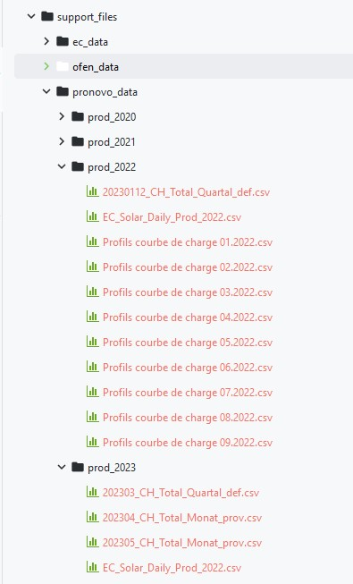
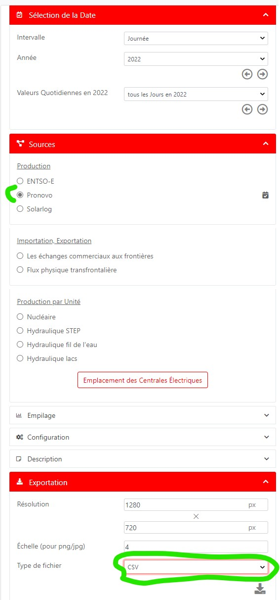
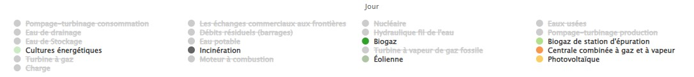

enr_residual_utils
=======================================

.. automodule:: ecodynelec.preprocessing.enr_residual_utils
   :members:
   :undoc-members:
   :show-inheritance:

.. _pronovo-and-energycharts-data-downloading:

Pronovo and EnergyCharts data downloading :
-------------------------------------------

Pronovo data
'''''''''''''

The Pronovo data can be found on `Pronovo <https://pronovo.ch/fr/services/rapports-et-publications/>`_, under the "Profils courbe de charge selon technologies" section.

The downloaded .csv files should then be placed in a 'support_files/pronovo_data/prod_year' (where year is the electricity production year) folder in the project directory.
For example:

As the solar production given by Pronovo doesn't covers all the solar production in Switzerland, this hourly data is scaled using the daily solar production given by
EnergyCharts: you should also download the daily EnergyCharts **solar** production data (see below) and place it in 'EC_Solar_year.csv' files.

EnergyCharts data
''''''''''''''''''

The EnergyCharts data is downloaded from `EnergyCharts <https://www.energy-charts.info/charts/energy/chart.htm?l=fr&c=CH&chartColumnSorting=default>`_:

    *Export settings*

    *Categories selection*

The downloaded .csv files should then be placed in a 'support_files/ec_data/' folder in the project directory.
