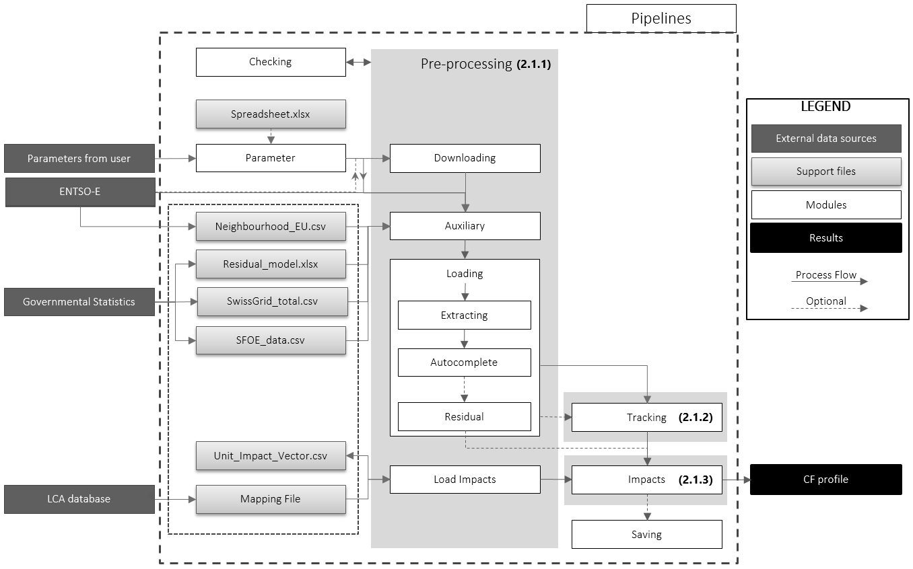

Architecture
============

The `dynamical` software is built as an ensemble of modules organized around 3 steps (Figure 1). The preprocessing steps include the download or loading of relevant data, the cleaning and adjustment to the correct time step. The large diversity of data lead to a high number of functions and increased complexity of the data treatment, thus all these functions were gathered in a sub-package called `preprocessing`. Then the pre-treated data can be used to track electricity "from the socket to the source", aggregated in `dynamical` as a type of electricity plant in a country. This process outptus the electric mix in a target country, i.e. the decomposition per source of  origin of 1kWh of electicity in the target country. Once the electric mix obtained, a third step uses the impact per electricity plant type (impact for this kind of plant to produce 1kWh of electricity) to calculate the overall impact of 1kWh of electricity.

.. image:: ../images/workflow.png
    :caption: Figure 1: Schematic visualization of different groups of functions in `dynamical`
    :alt: Dynamical group of functions
    
    
    
A more detailed schema of how the different modules intricate within `dynamical` is shown in Figure 2

.. toctree::
    :maxdepth: 2
    :hidden:
    
    global_execution.rst
    data_loading.rst
    load_impacts.rst
    tracking.rst
    impacts.rst
    local_residual.rst