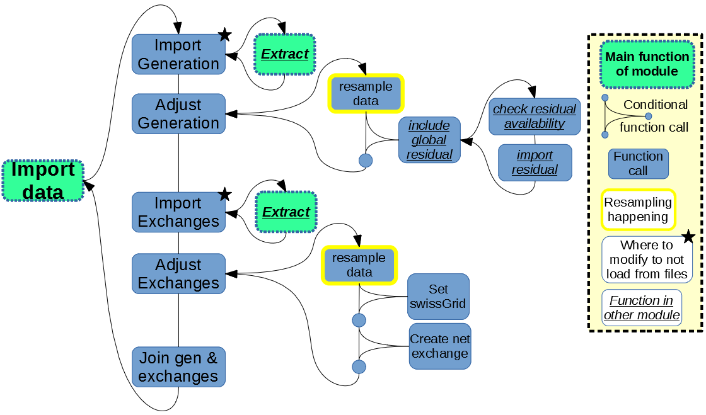
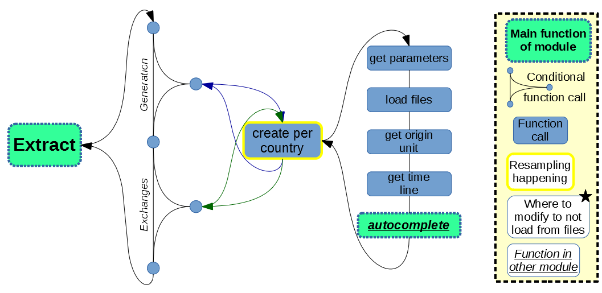

Data loading
============

The most complex part of ``dynamical`` consists in loading the data, as it deals with a large diversity of information. Thus the entire ``preprocessing`` subpackage was dedicated to these tasks. The downloading of data is not detailed here as this piece can be handled totally independently, simply connecting to the external server and writing files on the local computer before the process below reads these freshly downloaded files. Figure 1 shows how modules intricate within the preprocessing module.

    
    *Figure 1: General process of loading the data to ``dynamical``*
    
    
Specifically the ENTSO-E data is loaded via the "Extract" function, which is further detailed in Figure 2.

    
    *Figure 2: Extraction of data from ENTSO-E files*