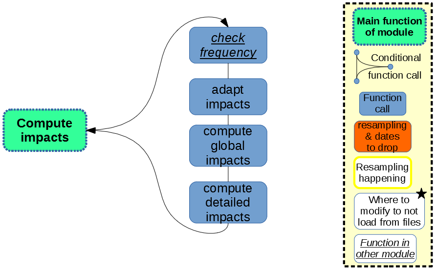

Impacts computation
===================

The final step of ``dynamical`` algorithm consists in coupling electricity mix information and impacts per production unit to calculate the overall impact of the 1kWh of electricity at the socket.

    
    *Figure 1: Impacts computation*