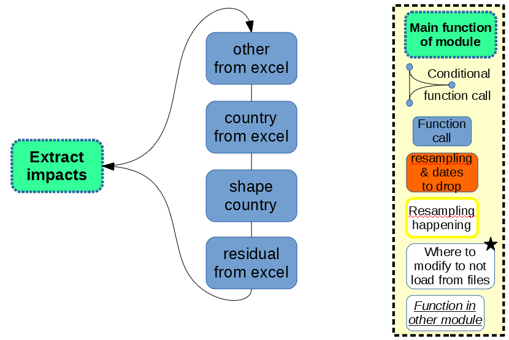

Load the impacts
================

Impact data must be loaded, which is harder than it seems. Most workflows are based on nice visual spreadsheets to easily be editted, which is literally a nightmare to then automatically retrieve the information for further automated tasks. A change of one letter in a non-relevant cell, a new row or a new column, and the algorithm is completely lost. To cope with these limitations as good as possible, a specific module is dedicated to simply load the impact data.

As detailed in different places in the documentation, the impacts per production unit type can be stored in two different files:

* the FU vector
* the mapping file

The FU vector is simply an already shaped matrix of data, ready-to-use, thus not much more information is needed here.

The mapping file is an excel file. A blank template may be downloaded on the `git repository <https://gitlab.com/fledee/ecodynelec/-/raw/main/examples/mapping_template.xlsx?inline=false>`_. The document must be provided blank as it relies on data which require information provided by proprietary sources such as the `Ecoinvent database <https://ecoinvent.org/>`_. Details about this mapping file and its structure is provided in a `dedicated page <https://ecodynelec.readthedocs.io/en/latest/supplementary/mapping_usage.html>`_ of the documentation.

    
    *Structure of impacts loading in ``ecodynelec``*
