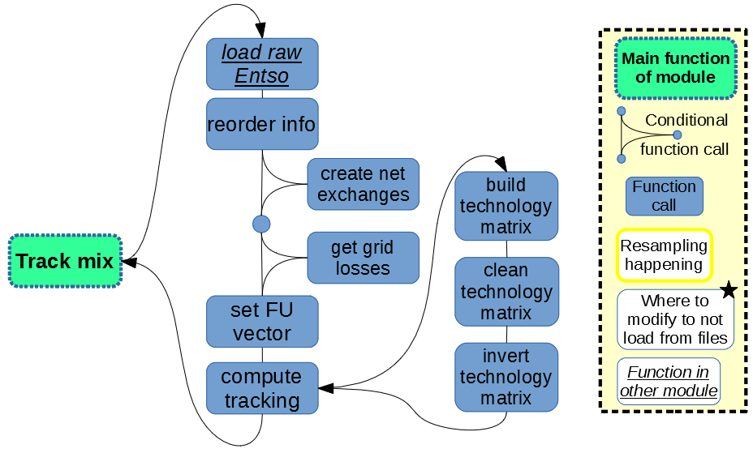
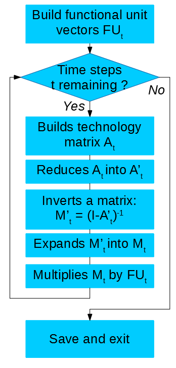
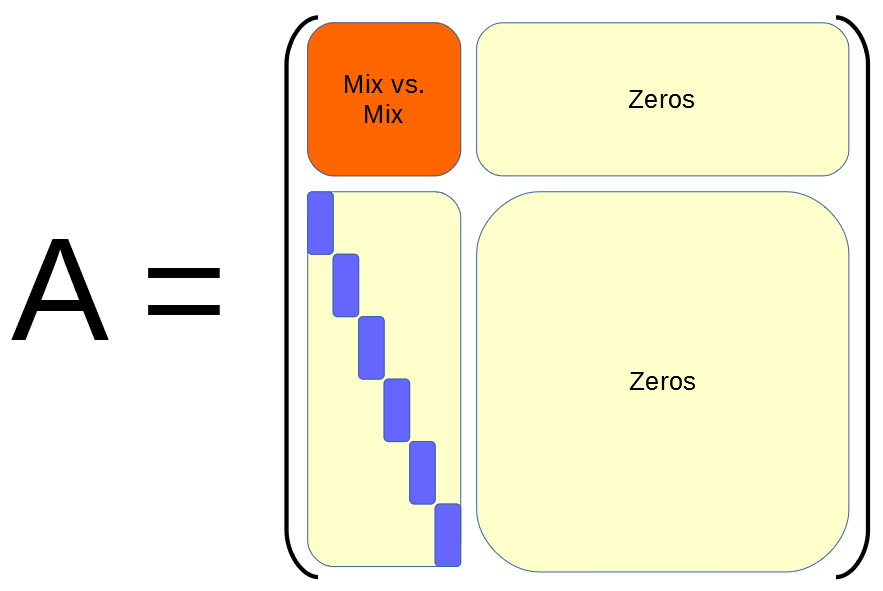
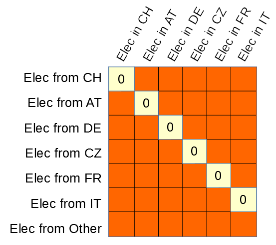
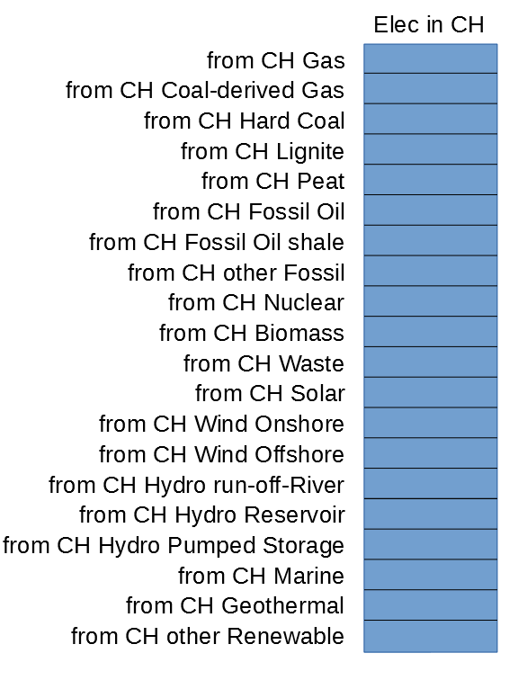

Tracking
=========

The electricity tracking algorithm is at the heart of `dynamical`. This methodology is the specificity of `dynamical` over other similar tools. The overall chaining of function is exposed in Figure 1.

    
    *Figure 1: Structure of the `tracking` module of `dynamical`.*
    
    
The whole principle of the electricity tracking is based on the fundamental equation of life-cycle-assessment (`Heijungs and Suh, 2002 <https://books.google.ca/books?id=pLwqBgAAQBAJ&dq=computational+structure+of+life+cycle+assessment&lr=>`_). The technology matrix is noted A, though the present description uses (I-A) as the matrix to invert, while the reference does invert the technology matrix A. This is only a question of notations but the maths are similar. The proper algorithm is executed as shown in Figure 2:

    
    *Figure 2: Algorithmic implementation of the electricity tracking*
    
The tracking algorithm consists in one matrix invesion per time step. For each time step, the generation and exchange data is used to built the technology matrix A, which represents a picture of all energy production and flows at that time step across the studied area. The structure and meaning of the technology matrix is detailed in Figures 3, 4 and 5.

The main step is the matrix invesion step. The best algorithms to perform this task have a complexity of O3, i.e. the computation burden increases proportionally to the cube of the size of the technology matrix. Thus to limit the computation burden, the technology matrix is reduced to a matrix A' in which all rows and columns full of zeros are removed (caused by a unit type producing zero at the present time step or by no-one importing from a given country). The reverse step of adding back rows and columns of zeros is processed after the matrix invesion.

    
    *Figure 3: Structure of the technology matrix*

    
    *Figure 4: Mix vs. Mix part of the technology matrix*

    
    *Figure 5: Data piece in the structure of the technology matrix*

The resulting matrix contains the information about all sources of electricty for the mixes in every involved country. The so-called functional-unit (FU) vector allows to select the correct column in the resulting matrix. It usually is a vector full of zeros, with a single 1 corresponding to the column to extract. Grid losses can be considered here, by replacing the single number in the vector by the amount of electricity to produce to deliver 1kWh to the user (i.e. a figure greater than 1). As grid losses change at every time step, one different FU vector per time step is used, thus the `t` index on Figure 2. More on this point in the `dedicated page <https://dynamical.readthedocs.io/en/latest/supplementary/functional_unit.html>`_ of the documentation.