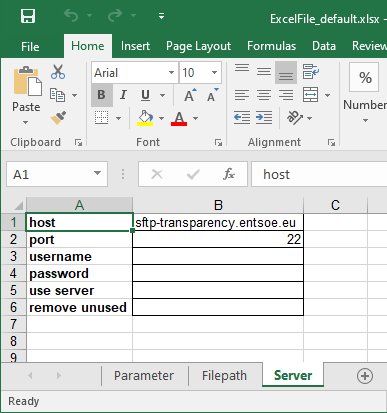

Download data from ENTSO-E databases
====================================

Connection to ENTSO-E Secured File Transfer Protocol (SFTP)
***********************************************************

To use the SFTP service, an account must be created on the `ENTSO-E website <https://transparency.entsoe.eu/>`_. The password may expire after some times and would need to be changed from this website too.

Manual Download of Data
***********************

Manual retrieval of the data requires an FTP software. We use `FileZilla <https://filezilla-project.org/>`_ to illustrate the procedure. Provide the software with:
    * Host: sftp://sftp-transparency.entsoe.eu
    * Port: 22
    * Personal username and password

Navigate through the remote architecture and download the files of interest. The generation files are located in ``/TP_export/AggregatedGenerationPerType_16.1.B_C/``. The exchanges files are located in ``/TP_export/PhysicalFlows_12.1.G/``. Next figure give details on how to proceed with FileZilla.

.. figure:: images/Filezilla.png
    :alt: The FileZilla interface downloading the target files

    *Figure 1: Download files using Filezilla*

Download data usign ``dynamical``
*********************************
This section shows how to use ``dynamical`` package to download the data.

As mentioned in Appendix: Handling the parameters, the connection information can be handled from the Server tab of an excel spreadsheet (Figure 2) or with the Parameter class of Dynamical using Python (Figure 3). For convenience in frequent reuse, the password can be written in plain text, though no encryption is used. For security reasons, the password can be omitted at that stage and be only provided later when DYNAMICAL connects with the server.

    
    *Figure 2: Download parameters from spreadsheet*

.. code-block:: python
    :caption: Manage download parameters in ``dynamical``

    # Import the parapeter-management tool
    from dynamical.parameter import Parameter

    # Initialize the tool
    params = Parameter()

    # Enter some parameters

    # Visualize the parameters

The module ``dynamical.load_data.download_raw`` can be used to download the required generation and exchanges files for all months covered by the user-defined dates (Figure 4). Before the download, the module verifies if it is worth transferring each file; download is aborted if (1) it already exists locally, (2) the local version was modified less than 15min before the remove version was modified and (3) the local file is 90% or less is size than the remote file. Conditions 2 and 3 allow to download again if a file was partially downloaded (interruption during of previous download). Their parameters (15min and 90%) can be modified by the user (Figure 4).

.. code-block:: python
    :caption: Trigger the downloading process with ``dynamical`` using the parameter tool

    from dynamical.load_data.download_raw import download
    download(p=param)

This module was incorporated in the easy_use module and can be triggered if the parameter useServer is set to True. See the complete download example for additional information.
