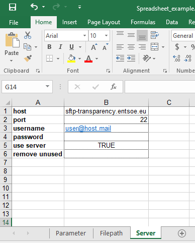

Download data from ENTSO-E databases
====================================

Connection to ENTSO-E Secured File Transfer Protocol (SFTP)
***********************************************************

To use the SFTP service, an account must be created on the `ENTSO-E website <https://transparency.entsoe.eu/>`_. The password may expire after some times and would need to be changed from this website too.

Manual Download of Data
***********************

Manual retrieval of the data requires an FTP software. We use `FileZilla <https://filezilla-project.org/>`_ to illustrate the procedure. Provide the software with:
    * Host: sftp://sftp-transparency.entsoe.eu
    * Port: 22
    * Personal username and password

Navigate through the remote architecture and download the files of interest. The generation files are located in ``/TP_export/AggregatedGenerationPerType_16.1.B_C/``. The exchanges files are located in ``/TP_export/PhysicalFlows_12.1.G/``. Next figure give details on how to proceed with FileZilla.

.. figure:: images/Filezilla.png
    :alt: The FileZilla interface downloading the target files

    *Figure 1: Download files using Filezilla*

Configuration to download with ``dynamical``
********************************************
This section shows how to use ``dynamical`` package to download the data.

Handling the parameters before the download allows to reduce the amount of files to download. The connection information can be handled with the `Parameter` class of Dynamical using Python or  from an excel spreadsheet (Figure 2). For convenience in frequent reuse, the password can be written in plain text, though no encryption is used. For security reasons, the password can be omitted at that stage and be only provided later when DYNAMICAL connects with the server.

Using Python
------------
Parameters can be managed from Python via the `Parameter` class, for the download and more generally for the whole process. Only the parameters detailed in the following examples are useful for the download. More information about the parameters is available at the `dedicated page <https://dynamical.readthedocs.io/en/latest/supplementary/parameters.html>`_.

.. code-block:: python
    :caption: Initialize parameters for the download in ``dynamical``

    ### Import the parameter-management tool
    from dynamical.parameter import Parameter

    ### Initialize the tool
    config = Parameter()

    ### Enter some parameters
    # Configure the server
    config.server.useServer = True # Specifically ask to download data
    config.server.host = "sftp-transparency.entsoe.eu" # This server is already set per default after initialization
    config.server.port = 22 # This port is already set per default after initialization
    config.server.username = "user@host.mail" # Username for connection on the ENTSO-E webpage

    # Time span to download only useful files
    config.start = '2017-02-01 05:00'
    config.end = '2017-02-01 13:00'
    
    # Where to save the files
    config.path.generation = "./test_data/downloads/generations/" # Generation data
    config.path.exchanges = "./test_data/downloads/exchanges/" # Exchange data

Using a Spreadsheet
-------------------
An alternative for more visual configuration is to use a spreadsheet (Figure 2). This approach more generally allows a configuration of the whole process, though this section focuses on the downloading abilities. Information from all three tabs of the spreadsheet is required, the most important being the Server tab. Acceptable formats for the spreadhseet are `.xlsx` (default), `.xls` (requires the additional `xlrd package <https://pypi.org/project/xlrd/>`_) and `.ods` (requires the additional `odfpy package <https://pypi.org/project/odfpy/>`_). An example spreadsheet can be downloaded from the `git repository <https://gitlab.com/fledee/ecodyn/-/raw/main/examples/Spreadsheet_example.xlsx?inline=false>`_.

    
    *Figure 2: Download parameters from spreadsheet*

The other required information is the start and end dates (Parameter tab) to select files and the generation and exchagne directories (Filepath tab) to save the downloaded files. More information about the parameters is available at the `dedicated page <https://dynamical.readthedocs.io/en/latest/supplementary/parameters.html>`_.

Download the data with ``dynamical``
************************************
Once the configuration is set properly, data can be downloaded.

Only the dowload
----------------

The module ``dynamical.preprocessing.download_raw`` can be used to download the required generation and exchanges files for all months covered by the user-defined dates (Figure 4). Before the download, the module verifies if it is worth transferring each file; download is aborted if (1) it already exists locally, (2) the local version was modified less than 15min before the remove version was modified and (3) the local file is 90% or less in size than the remote file. Conditions 2 and 3 allow to download again if a file was partially downloaded (interruption during of previous download). Their parameters (15min and 90%) are default values but can be modified by the user in the `download` function.

.. code-block:: python
    :caption: Trigger the downloading process with ``dynamical`` using the parameter tool

    from dynamical.preprocessing.download_raw import download
    download(config=param)
    
Alternatively, if a spreadsheet is used, the path to the spreadsheet can be passed to the `config=` parameter.

.. code-block:: python
    :caption: Downloading process with ``dynamical`` using the spreadsheet configuration

    from dynamical.preprocessing.download_raw import download
    download(config="~/Downloads/Spreadsheet_example.xlsx")

Chain download and execution
----------------------------

If the configuration is also set for further computation, the download can be chained with the rest of the process.

.. code-block:: python
    :caption: Triggering the whole process with ``dynamical`` using the spreadsheet configuration

    from dynamical.easy_use import execute
    results = execute(config=param)

.. code-block:: python
    :caption: Triggering the whole process with ``dynamical`` using the spreadsheet configuration

    from dynamical.easy_use import execute
    results = execute(config="~/Downloads/Spreadsheet_example.xlsx")