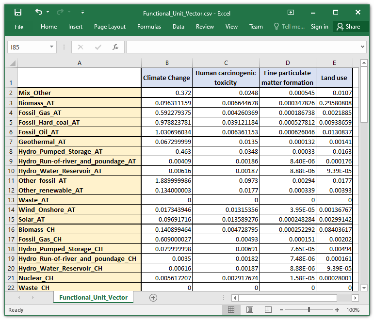

Functional Unit vector
======================

Impact per production unit
**************************

The functional unit (FU) vector actually a matrix constructed via extraction of information in block 5 of the mapping file, as described in the `dedicated page <https://dynamical.readthedocs.io/en/latest/supplementary/mapping_usage.html#file-structure>`_. Each column is an impact category obtained from the mapping file. The indexes are formatted as follows:
    * *Name_country*: Applicable for all unit types. The names are obtained from the mapping file. Remaining spaces in original names are replaced with an underscore (``_``). The countries are from the parameters. It is important to have the country at the end of the index, separated from the rest with an underscore (``_``).
    * *Mix_Other*: This unique row is used for all electricity imported from outside the bounds of the study (other countries). It is treated as a specific unit type called Mix from a specific country tagged Other. This specific index must be included in the vector.

    *Figure 1: Overview of the structure of the (default) FU vector*

Considering losses: what is FUt ?
*********************************

The code and equations make a difference between the FU vector and the applied functional unit at a specific time step FUt.
The first gathers the impacts of 1kWh of production from each unit type in each country. These values are modeling assumptions and do not change.

The second FUt is the FU vector multiplied by the grid losses at each time step. If grid losses are not considered, FUt is the vector of impacts multiplied by a vector of 1s.
